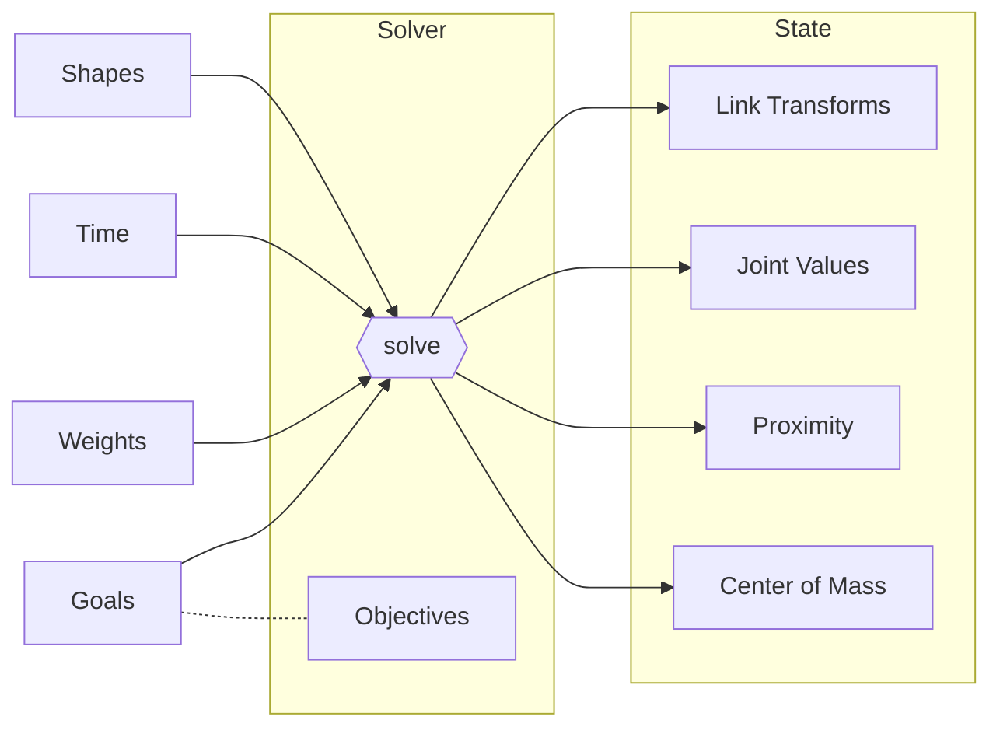

# Solver

The `Solver` contains the core functionality of the `Lively` toolkit. 
You can think of it as a single entry point for specifying behaviors and receiving robot instructions. 

```mermaid

graph LR
    G[Goals] --> SFn{{solve}}
    G -.- O
    W[Weights] --> SFn
    T[Time] --> SFn
    C[Shapes] --> SFn
    subgraph Solver
    O[Objectives]
    SFn
    end
    subgraph S[State]
    SFn --> L[Link Transforms]
    SFn --> J[Joint Values]
    SFn --> P[Proximity]
    SFn --> M[Center of Mass]
    end
```