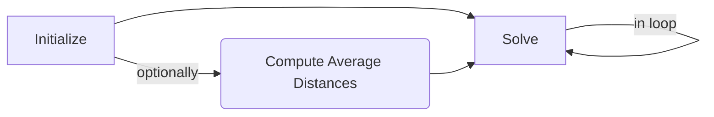

# Solver

## Introduction
The `Solver` contains the core functionality of the `Lively` toolkit. 
You can think of it as a single entry point for specifying behaviors and receiving robot instructions. 

## Workflow

Generally, the usage of the solver involves a regular sequence of steps. 
To begin, the Solver is [`initialized`](./initialization) with a set of parameters, 
including the robot's URDF, a set of [`objectives`](../Objectives/), 
initial joint [`state`](../state), and a description of the collision environment.

It is optional, but advised, to then execute the [`compute_average_distance_table`](./Methods/collision_normalization) 
method to normalize the distances between links and the environment to improve the performance of the collision avoidance algorithm.
Note, if proximity information from a previous run that was normalized is provided as part of the initialization 
[`state`](../state), it will re-use the normalization calculated there. 

Finally, the solver's [`solve`](./Methods/solve) method can be run in a loop, such that each loop any change in goals 
is passed, and the new computed state is returned.

In the following sections you will see how the solver is initialized, utilized, and structured.